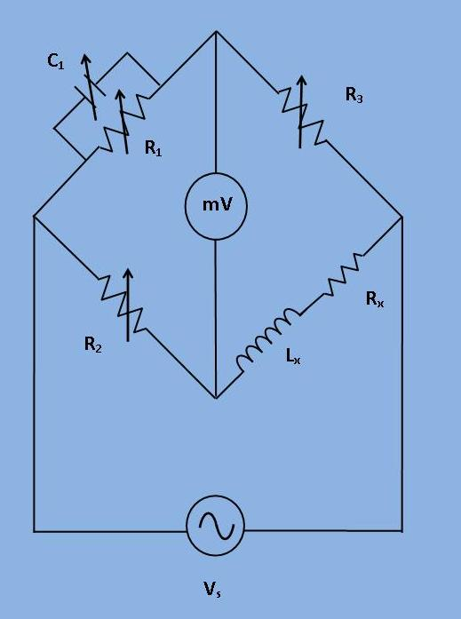

## Procedure

***Fig 1: Circuit Diagram for experimental set-up of Maxwell's bridge***

1. Connect all the components and the air cored coil as shown in the figure.
 
2. Set the product of R2 R3 at a convenient value and obtain the balance by varying R1 and C1
 
3. Decide the ranges for R1 and C1 through which they can varied without bringing database at noise C.R.O.
  
4. Repeat the procedure with different values of the product R2 R3 and decide upon readings that permit maximum accuracy for the measurement.
